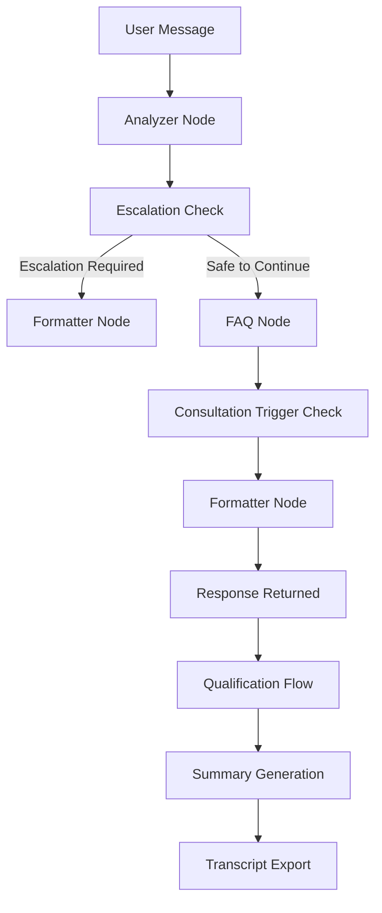
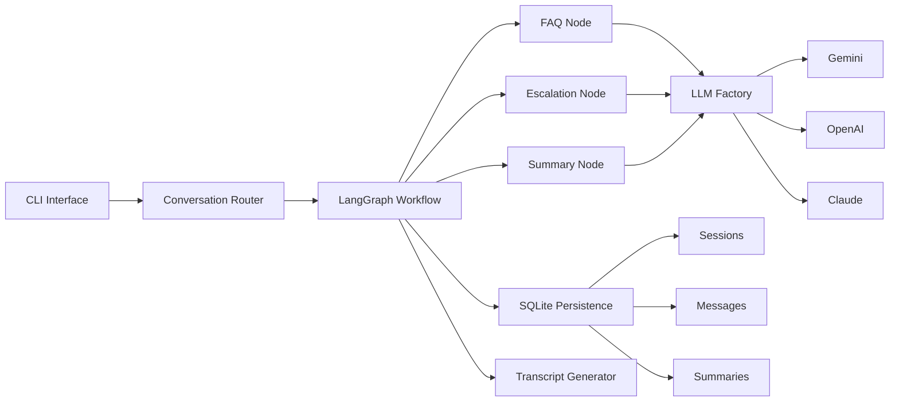

# Closira AI Support Workflow System

An AI-powered customer support workflow orchestration system built using LangGraph, FastAPI, and multi-provider LLM integration.

This project was developed as an internship assignment to demonstrate:

* AI workflow orchestration
* SOP-grounded customer support
* lead qualification workflows
* escalation handling
* structured conversation summaries
* stateful conversational memory

The system supports FAQ answering, lead qualification, escalation detection, and session summarization using a deterministic AI workflow architecture.

---

# Features

* SOP-grounded FAQ answering
* Multi-turn conversational workflow
* Hybrid escalation system

  * Rule-based escalation
  * LLM-based semantic escalation
* Lead qualification flow
* Structured JSON outputs
* Session summary generation
* SQLite-based persistence
* Multi-provider LLM support

  * Gemini
  * OpenAI
  * Claude
* Transcript auto-generation
* CLI-based conversational interface

---

# LangGraph Workflow



---

# System Architecture



---

# Tech Stack

| Component              | Technology             |
| ---------------------- | ---------------------- |
| Workflow Orchestration | LangGraph              |
| Backend Framework      | FastAPI                |
| LLM Framework          | LangChain              |
| Database               | SQLite                 |
| ORM                    | SQLAlchemy             |
| CLI UI                 | Rich                   |
| LLM Providers          | Gemini, OpenAI, Claude |
| Language               | Python                 |

---

# Project Structure

```bash
app/
├── api/
├── cli/
├── core/
├── db/
├── graph/
│   └── nodes/
├── llm/
├── prompts/
├── services/

test_transcripts/
tests/
```

---

# Workflow Stages

## Stage 1 — FAQ Answering

The assistant answers customer queries strictly using the provided SOP knowledge base.

Key capabilities:

* grounded responses
* hallucination prevention
* confidence scoring
* structured outputs

---

## Stage 2 — Lead Qualification

When the customer shows booking or consultation intent, the system transitions into a qualification workflow.

Collected information:

* business type
* team size
* current tools/systems

---

## Stage 3 — Escalation Detection

Escalation runs continuously during conversations.

Escalation triggers include:

* complaints
* medical questions
* angry sentiment
* pricing negotiation
* human handoff requests

The system uses a hybrid escalation architecture:

* deterministic keyword rules
* semantic LLM classification

---

## Stage 4 — Session Summary

At the end of the session, the system generates:

* customer intent summary
* collected lead details
* SOP gaps
* escalation reason
* recommended next action

Summaries are stored in SQLite and exported into markdown transcripts.

---

# Example Conversation

```text
[You]
> What are your Botox prices?

[Closira AI]
Botox treatments start from £200.

[You]
> What are your clinic hours?

[Closira AI]
Bloom Aesthetics Clinic is open Mon–Sat, 9 am – 7 pm.

Would you like to book a free consultation?
```

---

# Key Engineering Decisions

## Deterministic Workflow Design

The system intentionally avoids autonomous agent architectures and instead uses deterministic workflow routing for:

* reliability
* explainability
* easier debugging
* safer escalation handling

---

## Structured LLM Outputs

All critical LLM interactions return structured JSON outputs to improve:

* consistency
* validation
* reliability
* downstream processing

---

## SOP Grounding

Responses are constrained to SOP information to minimize hallucinations and unsafe responses.

---

## Hybrid Escalation Architecture

Escalation combines:

* rule-based safety checks
* semantic LLM classification

This improves both reliability and conversational flexibility.

---

# Setup Instructions

## 1. Clone Repository

```bash
git clone <repo_url>
cd closira-ai-assignment
```

---

## 2. Create Virtual Environment

```bash
python -m venv venv
source venv/bin/activate
```

---

## 3. Install Dependencies

```bash
pip install -r requirements.txt
```

---

## 4. Configure Environment Variables

Create `.env`

```env
DEFAULT_PROVIDER=gemini

GOOGLE_API_KEY=your_api_key

MODEL_NAME=gemini-2.5-flash

DATABASE_URL=sqlite+aiosqlite:///./closira.db
```

---

## 5. Initialize Database

```bash
python -m tests.init_db
```

---

## 6. Run CLI Application

```bash
python -m app.cli.chat
```

---

# Example Commands

| Command    | Description              |
| ---------- | ------------------------ |
| `/summary` | Generate session summary |
| `/help`    | Show commands            |
| `/exit`    | Exit session             |

---

# Generated Outputs

The system automatically generates:

* SQLite conversation persistence
* markdown transcripts
* structured session summaries

Transcript examples are stored in:

```bash
test_transcripts/
```

---

# Author

Sid Naik
